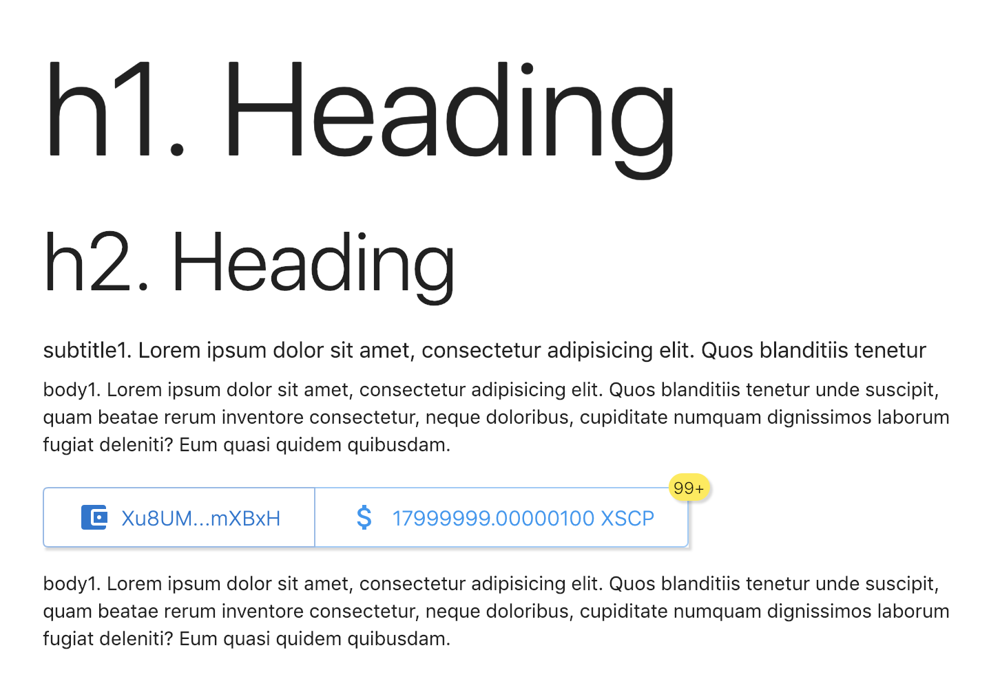

# XSCP

## Blockchain platform to reward any content authors

https://xscp.icu

## What is Scope?

Scope is a coin project to bring Authors reward function to any website. We developed Web Browser extension to place Reward Widget on any website where you can post plain text, add signature or add some kind of description to any type of content. Reward Widget allows anybody who has active Extension and Wallet running locally to reward anybody who shared a XSCP signature easely. Extension connects to Wallet through RPC API calls and making payments on demand. Users w/o active extension continue seeing raw XSCP signature.

Moreover rewards count and amount can be used as content popularity indicator. Read more at Reward Extension section.

## Download Wallets

https://dist.xscp.icu/.

License
-------

Scope Coin is released under the terms of the MIT license. See [COPYING](COPYING) for more
information or see https://opensource.org/licenses/MIT.
